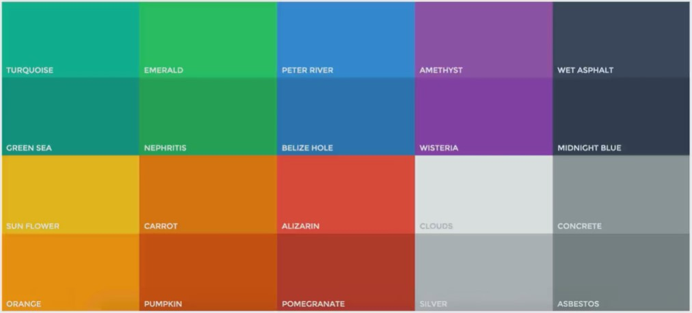

## Colors

Picking a color for a website means more then picking your favorite color and turning it into a design. It means picking the right color in order to get the desired response from your audience. Color really makes a difference. This happens because there are psychological effects behind each color

- ### Use only one base color.

  https://flatuicolors.com/

  https://paletton.com/

  http://www.materialpalette.com/

  http://www.colorhunt.co/

  http://www.lolcolors.com/

  http://uigradients.com/

  http://www.0to255.com/

  https://www.coleure.com/

  

- ### Use the main color to draw attention to the most important elements on your web-page like a call to action button.
- ### Use the second or third color to compliment the main color.
- ### Never use black in your design.
- ### Choose colors wisely.
  - Brighter tones are more energetic.
  - Darker tones are more powerful and elegant.
  - #### Red
    - Power
    - Passion
    - Strength
    - Excitement
  - #### Orange
    - Attention without being as overpowering as red.
    - Cheerfulness
    - Creativity
    - Friendliness
    - Confidence
    - Courage
  - #### Yellow
    - Energetic
    - Happiness
    - Loveliness
    - Curiosity
    - Intelligence
    - Brightness
  - #### Green
    - Harmony
    - Nature
    - Life
    - Health
    - Money
    - Can have a balancing and harmonizing effect.
  - #### Blue
    - Patience
    - Peace
    - Trustworthiness
    - Stability
    - Most beloved colors especially by men.
    - Professionalism
    - Trust
    - Honor
  - #### Purple
    - Power
    - Knowability
    - Wealth
    - Wisdom
    - Royalty
    - Nobility
    - Luxury
    - Mystery
  - #### Pink
    - Romance
    - Passivity
    - Care
    - Peace
    - Affection
  - #### Brown
    - Relaxation
    - Confidence
    - Earthiness
    - Nature
    - Durability
    - Comfort
    - Reliability
