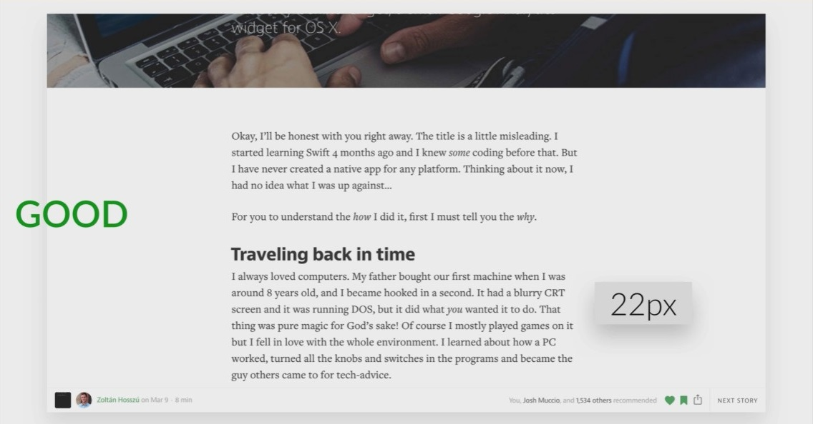
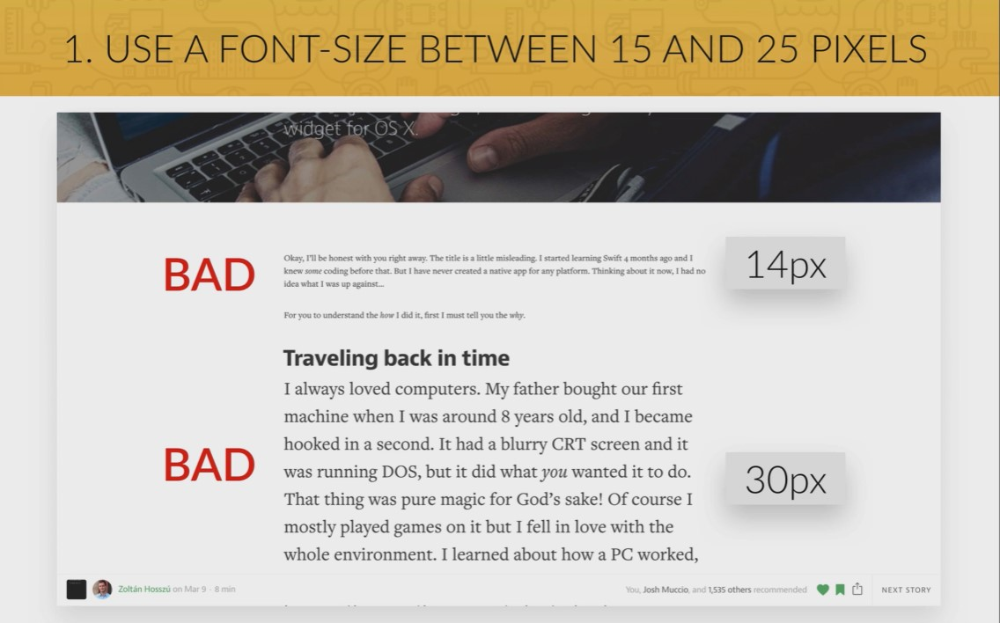
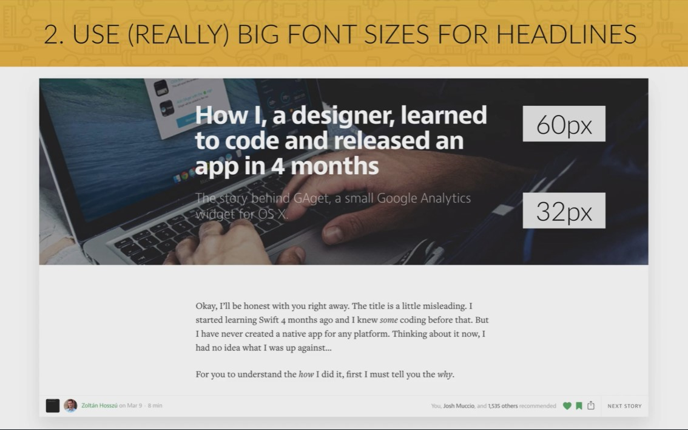
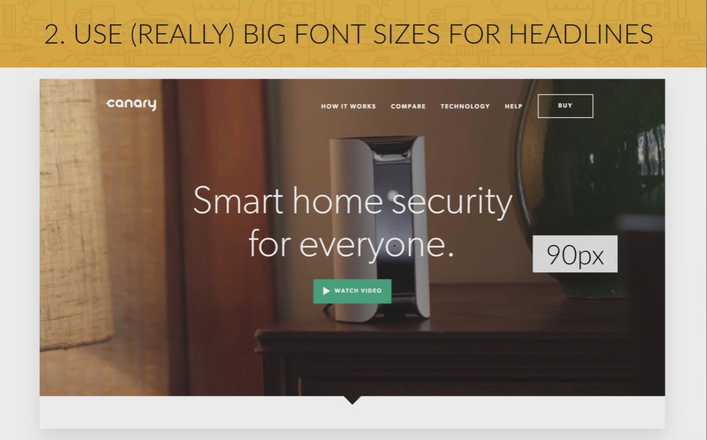
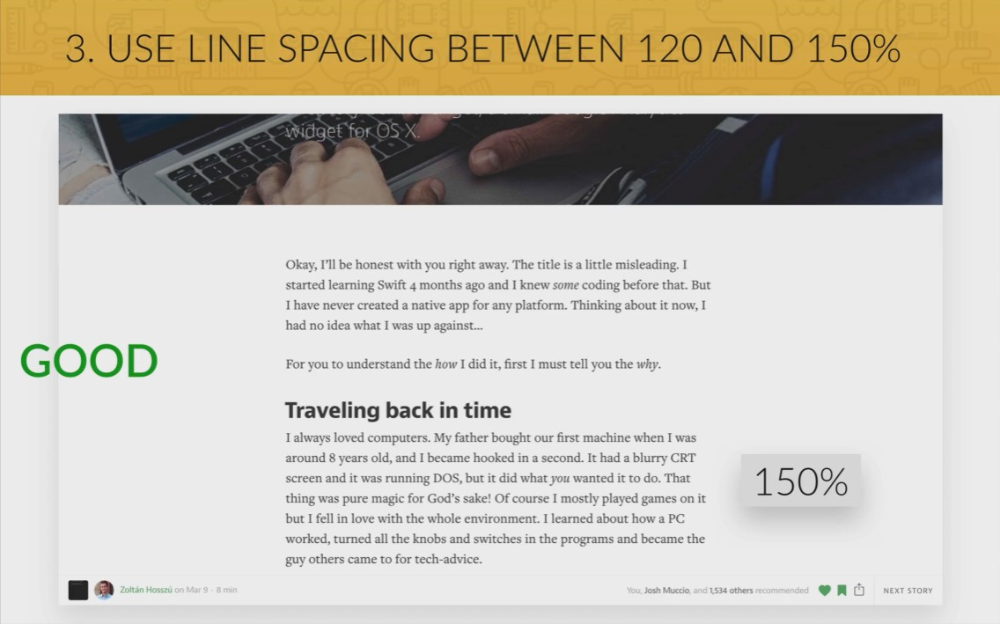
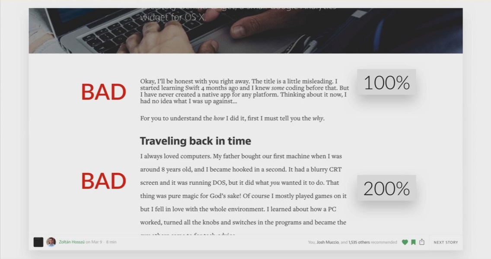

## Font

- ### Use a font-size between 15 and 25 pixels.

  
  

- ### Use (Really) big font sizes for headlines.

  

- ### When using extremely big font-size in headlines decrease the font weight

  

- ### Use line spacing between 120 and 150%

  
  

- ### 45 to 90 Characters per line
- ### Use good fonts (no rules exists but the cleaner the better)
  - Good recommendations
    - Open Sans
    - Lato
    - Raleway
    - Monsterrat
    - PT Sans
    - Poppins
  - For large text like a blog page those are recommended:
    - Cardo
    - Merriweather
    - Pt Serif
  - How to choose a font?
    - Choose a font which reflects the look and feel you want for your website
    - Decide: _sans-serif_ or _serif_ typeface?
    - Use a good font
    - Use only that one typeface
