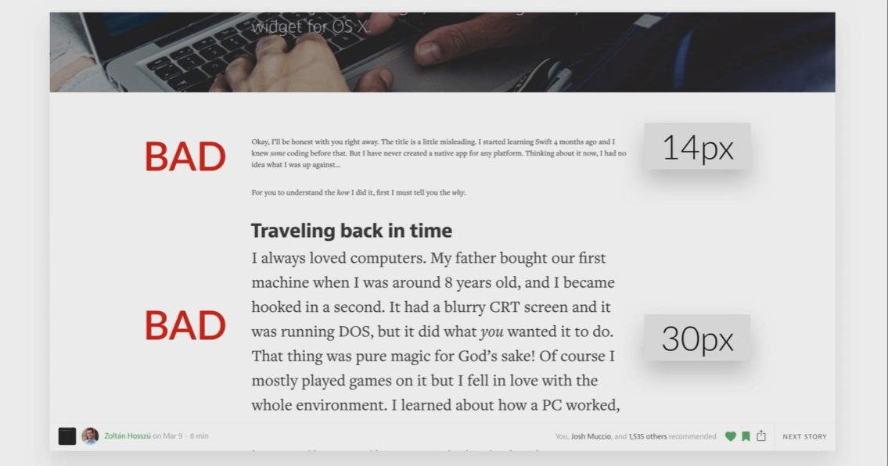

## Font

- Use a font-size between 15 and 25 pixels.
   
- Use (Really) big font sizes for headlines.
  
- When using extremelly big font-size in headlines decrease the font weight
  
- Use line spacing between 120 and 150%
  
  
- 45 to 90 Characters per line
- Use good fonts
