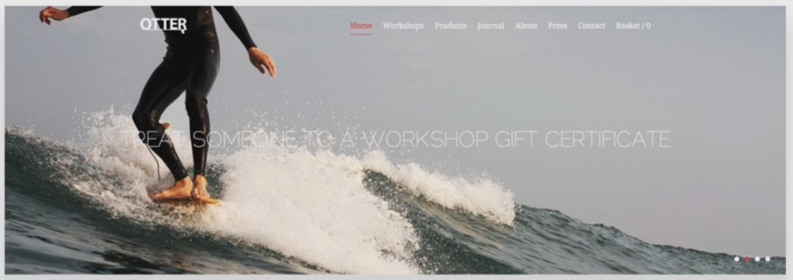
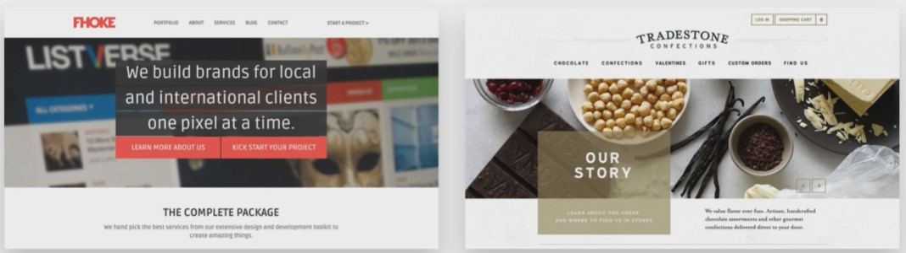
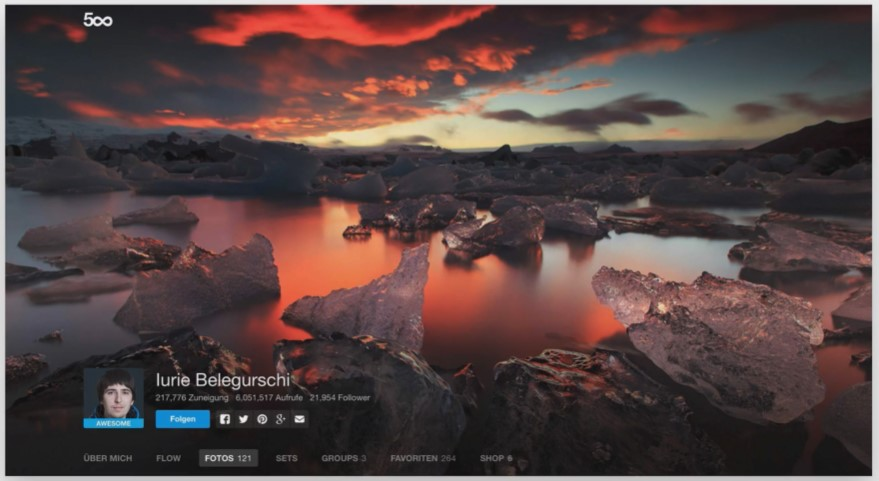

## Images

These days big and beautiful images are everywhere in web design.
In fact using large background images can make your web site look more attractive and create more user engagement.

https://unsplash.com/

http://thestocks.im/

http://isorepublic.com/

https://pixabay.com/en/

http://subtlepatterns.com/

http://www.istockphoto.com/

https://randomuser.me/

http://www.coverr.co/

http://startupstockphotos.com/

https://placeit.net/

https://www.canva.com/

- ## Image heavy web sites convert better.

- ## Add text directly to an image

  - Problems

    - Only works if the image is quite dark and your text is white.

    

  - Solutions

    - Overlay the image with a color (Usually black)

    

    

    

    - Put the text in a box

    

    

    - Blur the image

    

    

    - Use floor fade

    

  - Some examples:
    - https://jsfiddle.net/drpak8vy/1/
    - http://jsfiddle.net/qg83m36p/
    - http://jsfiddle.net/gRzPF/409/
